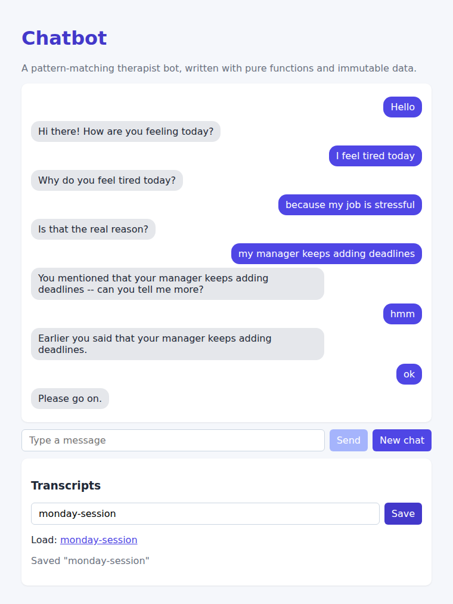

# Chatbot

An ELIZA-style chatbot. The user's message is split into words and matched against a list
of patterns; the first match picks a response template, and captured words are echoed
back with pronouns swapped (`my` → `your`, `I` → `you`).

```
You:  I feel tired today
Bot:  Why do you feel tired today?
You:  my job is stressful
Bot:  You mentioned that your job is stressful -- can you tell me more?
You:  hmm
Bot:  Earlier you said that your job is stressful.
```



## How it works

- `src/server/list.ts` – immutable linked list (`nil` / `cons`) with recursive helpers.
- `src/server/chatbot.ts` – pure functions:
  - `matchPattern(words, pattern)` – recursive matcher. `.` captures zero or more words and `*` skips them.
  - `fillTemplate(template, captures)` – fills `.` slots in a response.
  - `respond(input, state, patterns)` → `{ reply, state }`. Rotates through responses
    for each pattern and remembers "my …" statements to bring them up later. The input
    state is never mutated.
- `src/server/routes.ts` – Express API: `POST /api/chat`, `POST /api/save`,
  `GET /api/load`, `GET /api/names`.
- `src/client/` – React UI with chat bubbles and saving/loading transcripts.

## Scripts

```bash
npm install
npm run dev     # server :8080 + client :5173
npm test        # 21 Mocha tests (list, matcher, templates, respond, routes)
```
