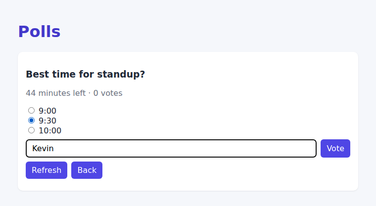
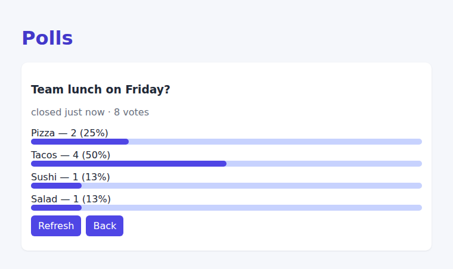

# Polls

Create a poll with a question, options, and a time limit. People vote while it's open
(voting again replaces your earlier vote), and results appear with bar charts once it closes.

| Voting | Results |
| --- | --- |
|  |  |

## How it works

- `src/server/polls.ts` – pure, immutable domain logic:
  - `createPoll` / `castVote` return `Result<Poll>`: either a **new** poll or an error message.
  - `tally` counts votes and percentages; `sortPolls` lists open polls (ending soonest)
    before closed ones (most recent first).
  - `summarize` builds the public view, which hides who voted for what.
- `src/server/routes.ts` – Express API: `GET /api/list`, `POST /api/add`, `GET /api/get`,
  `POST /api/vote`. The clock is injected so tests can move time forward.
- `src/client/` – React UI with three pages (list, new poll, details) modeled as a
  discriminated union.

## Scripts

```bash
npm install
npm run dev     # server :8080 + client :5173
npm test        # 16 Mocha tests (poll logic + routes, including closing over time)
```
